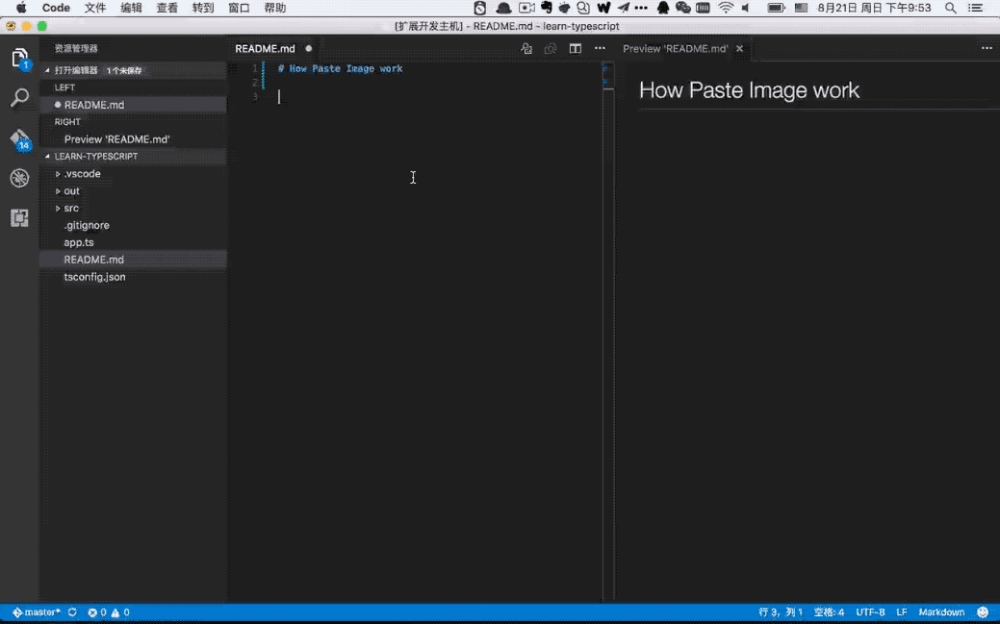
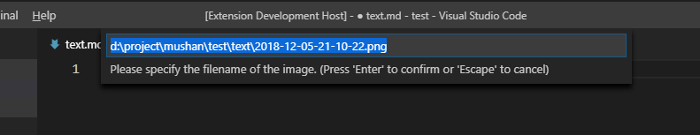

# Paste Image

Paste image directly from clipboard to markdown/asciidoc(or other file)!

**Support Mac/Windows/Linux!** And support config destination folder.

Now you can enable `pasteImage.showFilePathConfirmInputBox` to modify file path before save:

## Usage

1. capture screen to clipboard
2. Open the command palette: `Ctrl+Shift+P` (`Cmd+Shift+P` on Mac)
3. Type: "Paste Image" or you can use default keyboard binding: `Ctrl+Alt+V` (`Cmd+Alt+V` on Mac).
4. Image will be saved in the folder that contains current editing file
5. The relative path will be paste to current editing file 

## Config

- `pasteImage.defaultName`

    The default image file name.

    The value of this config will be pass to the 'format' function of moment library(a js time manipulation library), you can read document https://momentjs.com/docs/#/displaying/format/ for advanced usage.

    And you can use variable:

    - `${currentFileName}`: the current file name with ext.
    - `${currentFileNameWithoutExt}`: the current file name without ext.

    Default value is `Y-MM-DD-HH-mm-ss`.

- `pasteImage.path`

    The destination to save image file.
    
    You can use variable:
    
    - `${currentFileDir}`: the path of directory that contain current editing file. 
    - `${projectRoot}`: the path of the project opened in vscode.
    - `${currentFileName}`: the current file name with ext.
    - `${currentFileNameWithoutExt}`: the current file name without ext.

    Default value is `./`.

- `pasteImage.showFilePathConfirmInputBox`

    Enabling this `boolean` setting will make Paste Image ask you to confirm the file path(or file name). This is useful if you want to change the file path of the image you are currently pasting. Default is `false`.

## Format

### File name format

If you selected some text in editor, then extension will use it as the image file name. **The selected text can be a sub path like `subFolder/subFolder2/nameYouWant`.**

If not the image will be saved in this format: "Y-MM-DD-HH-mm-ss.png". You can config default image file name by `pasteImage.defaultName`.

### File link format

When you editing a markdown, it will pasted as markdown image link format ``.

When you editing a asciidoc, it will pasted as asciidoc image link format `image::imagePath[]`.

In other file, it just paste the image's path.

## Contact

If you have some any question or advice, Welcome to [issue](https://github.com/mushanshitiancai/vscode-paste-image/issues)

## TODO

- [x] support win (by @kivle)
- [x] support linux
- [x] support use the selected text as the image name
- [x] support config (@ysknkd in #4)
- [x] support config relative/absolute path (@ysknkd in #4)
- [x] support asciidoc
- [x] support use variable ${projectRoot} and ${currentFileDir} in config
- [x] support config basePath
- [x] support config forceUnixStyleSeparator
- [x] support config prefix
- [x] support config suffix
- [x] support use variable ${currentFileName} and ${currentFileNameWithoutExt} in config
- [x] support check if the dest directory is a file
- [x] support select text as a sub path with multi new directory like `a/b/c/d/imageName` or `../a/b/c/d/imageName`
- [x] support config default image name pattern
- [x] support config the text format
- [x] support file path confirm box (by @DonMartin76)

## License

The extension and source are licensed under the [MIT license](LICENSE.txt).

